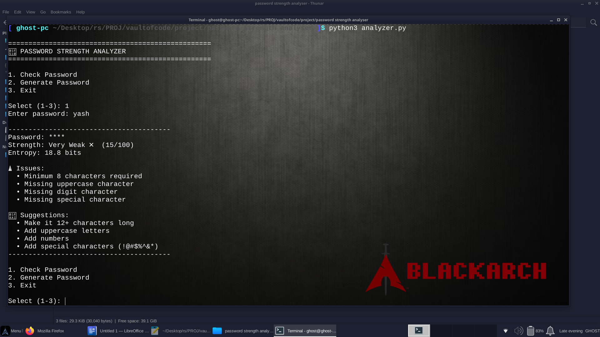
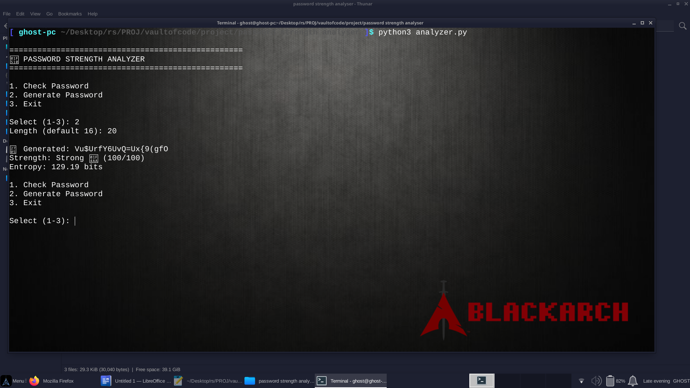
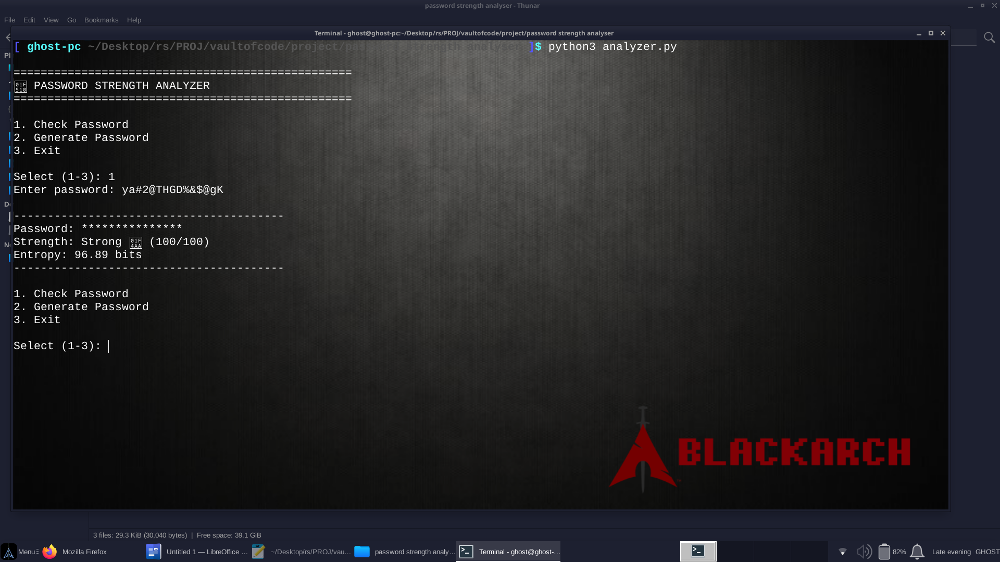

# 🔐 Password Strength Analyzer

> A Python-based cybersecurity tool that analyzes password strength, detects weak patterns, calculates estimated entropy, checks against a local leaked-password database, and generates stronger passwords.

---

## 📌 About The Project


Many users create passwords that are short, predictable, or based on common words, names, dates, keyboard patterns, or repeated characters.


**Password Strength Analyzer** is a command-line cybersecurity project developed in Python to help users understand how strong or weak a password is.


The tool performs multiple security checks and generates a **0–100 strength score**, along with detected issues, estimated entropy, and suggestions for improving the password.


It also includes a password generator that creates random passwords using different character types.

---

## 🎯 Problem Statement

Weak and predictable passwords are a common cybersecurity risk. Users frequently create passwords based on common words, names, dates, keyboard patterns, or repeated characters.

For example:

```text
password123
admin
qwerty123
john1998
123456
```

Such passwords may be easier for attackers to guess using techniques such as dictionary attacks, pattern-based guessing, and brute-force attempts.

Therefore, this project aims to provide a simple educational tool that can:

  * 🔍 Check password strength
  * 🚨 Detect common weaknesses
  * 🔎 Identify predictable patterns
  * 🧮 Estimate password entropy
  * 🗃️ Check against a local leaked-password list
  * 💡 Provide security recommendations
  * 🔐 Generate stronger random passwords

---

## ✨ Features

### 🔹 1. Password Length Validation

The analyzer checks the length of the entered password.

A minimum length of **8 characters** is required for the basic strength evaluation.

Passwords of 12 or more characters receive the maximum length score.

---

### 🔹 2. Character Type Analysis

The tool checks which types of characters are present:

  * 🔠 Uppercase letters (`A-Z`)
  * 🔡 Lowercase letters (`a-z`)
  * 🔢 Numbers (`0-9`)
  * 🔣 Special characters (`! @ # $ % ^ & * etc.`)
  
Each detected character type contributes to the password score.

---

### 🔹 3. Sequential Pattern Detection

The analyzer looks for predictable sequential patterns such as:

```text
123
456
abc
xyz
321
cba
```

Sequential patterns can make passwords easier to guess.

---

### 🔹 4. Repeated Character Detection

The tool detects repeated characters such as:

```text
aaa
111
!!!
xxx
```

Repeated patterns reduce password unpredictability.

---

### 🔹 5. Keyboard Pattern Detection

Common keyboard sequences are checked, including patterns such as:

```text
qwerty
asdf
zxcv
qazwsx
```

These patterns are frequently used in weak passwords.

---

### 🔹 6. Common Word / Name Detection

The analyzer checks for commonly used words and names.

Examples include:

```text
password
admin
welcome
user
```

Passwords based on common words can be easier to predict.

---

### 🔹 7. Date and Year Detection

The tool can identify predictable date/year patterns such as:

```text
1999
2001
2026
12081999
```

Using birthdays, years, or other predictable dates in passwords can reduce security.

---

### 🔹 8. Entropy Calculation

The analyzer calculates an estimated password entropy in **bits**.

Entropy represents the potential unpredictability of a password.

A simplified calculation can be represented as:

```text
Entropy = Length × log₂(Character Pool Size)
```

Higher entropy generally indicates a larger search space.

---

### 🔹 9. Leaked Password Check

The project supports checking passwords against a **local leaked-password list**.

The optional database is stored in:

```text
leaked.txt
```

This allows the tool to identify passwords that are already present in the local compromised-password dataset.

> **Privacy:** The project is designed for local analysis and does not require uploading passwords to a cloud server.

---

### 🔹 10. Strong Password Generator

The project can generate strong random passwords using a combination of:

```text
Uppercase Letters
Lowercase Letters
Numbers
Special Characters
```

Example:

```text
R7!mQ2#xLp9@K4
```

---

### 🔹 11. Security Score

The analyzer generates a score between:

```text
0 – 100
```

The score is based on multiple security factors rather than only password length.

---

## 📊 Scoring System

| Category              | Maximum Points |
| --------------------- | -------------: |
| 📏 Password Length  	|             20 |
| 🔤 Character Types	|             20 |
| 🛡️ No Security Issues	|             30 |
| 🧮 Entropy      	|             30 |
| **🏆 Total**         	|        **100** |

### 🏆 Strength Levels

|      Score | Strength       	|
| ---------: | -------------- 	|
| **80–100** | 🟢 Strong 💪   	|
|  **60–79** | 🟡 Good 👍     	|
|  **40–59** | 🟠 Weak ⚠️     	|
|   **0–39** | 🔴 Very Weak ❌ 	|

---

## 🔄 How the Analyzer Works

The password analysis follows this general workflow:

```text
             ┌────────────────────┐
             │   Enter Password   │
             └─────────┬──────────┘
                       ↓
             ┌────────────────────┐
             │  Check Password    │
             │      Length        │
             └─────────┬──────────┘
                       ↓
             ┌────────────────────┐
             │  Check Character   │
             │       Types        │
             └─────────┬──────────┘
                       ↓
             ┌────────────────────┐
             │ Detect Weak        │
             │ Patterns           │
             └─────────┬──────────┘
                       ↓
             ┌────────────────────┐
             │ Check Common       │
             │ Words / Names      │
             └─────────┬──────────┘
                       ↓
             ┌────────────────────┐
             │ Check Dates /      │
             │ Years              │
             └─────────┬──────────┘
                       ↓
             ┌────────────────────┐
             │ Check Leaked       │
             │ Password List      │
             └─────────┬──────────┘
                       ↓
             ┌────────────────────┐
             │ Calculate Entropy  │
             └─────────┬──────────┘
                       ↓
             ┌────────────────────┐
             │ Calculate Score    │
             └─────────┬──────────┘
                       ↓
             ┌────────────────────┐
             │ Issues +           │
             │ Suggestions        │
             └────────────────────┘
```

---

## 🧠 Analysis Process

The analyzer performs the following steps:

1. Accepts a password from the user.
2. Checks password length.
3. Identifies the character types used.
4. Searches for sequential patterns.
5. Searches for repeated characters.
6. Checks common keyboard patterns.
7. Checks common words and names.
8. Checks date/year patterns.
9. Checks the local leaked-password list.
10. Calculates estimated entropy.
11. Generates a score between 0 and 100.
12. Displays detected issues.
13. Provides suggestions for improvement.

---

## 💻 Example

### Input

```text
Enter password: Password123!
```

### Output

```text
Password: ************

Strength: Good 👍 (75/100)

Entropy: 48.3 bits

⚠️ Issues:
• Contains common word/name

💡 Suggestions:
• Avoid common words/names
• Make it 12+ characters long
```

---

## 🔐 Example of a Strong Password

Example generated password:

```text
vR7!qL2@xP9#kT4$
```

Possible characteristics:

	🔢 Contains numbers
	🔠 Contains uppercase characters
	🔡 Contains lowercase characters
	🔣 Contains special characters
	📏 Longer password length
	🚫 No obvious dictionary word
	🚫 No obvious sequential pattern
	🚫 No obvious keyboard pattern

For real accounts, use unique passwords and store them securely in a trusted password manager.

## 🖥️ Command-Line Interface

When the program starts, the following menu is displayed:

==================================================
🔐 PASSWORD STRENGTH ANALYZER
==================================================


1. Check Password
2. Generate Password
3. Exit

Option 1 — Check Password

Analyzes a password and displays:

Strength
Score
Entropy
Detected Issues
Suggestions

The entered password is masked when displaying the analysis result.

Option 2 — Generate Password

Allows the user to select a password length and generates a random password.

Option 3 — Exit

Closes the application safely.

---

## 🛠️ Technologies Used

	🐍 Python 3.6+
	🔤 String Processing
	🔎 Regular Expressions
	🧮 Mathematical Calculations
	🔐 Password Analysis
	🎲 Random Password Generation
	🗃️ Local File-Based Password Checking
	💻 Command-Line Interface
	📦 Python Modules

The project uses modules including:

re
math
hashlib
string
random
typing

Note: The current source code also contains an unused requests import. Since requests is not used anywhere in the current implementation, it can be removed to keep the project dependent only on Python's standard library.

---

## 📁 Project Structure

```
password_strength_analyzer/
│
├── analyzer.py          # Main password analyzer program
├── leaked.txt           # Optional local leaked-password list
├── README.md            # Project documentation
│
└── screenshots/         # Screenshots demonstrating program output
    ├── output1.png
    ├── output2.png
    └── output3.png
```

### File Description

| File / Folder  | Purpose                                                                          |
| -------------- | -------------------------------------------------------------------------------- |
| `analyzer.py`  | Main Python program responsible for password analysis and related functionality. |
| `leaked.txt`   | Optional local list of leaked/common passwords used for checking.                |
| `README.md`    | Complete project documentation.                                                  |
| `screenshots/` | Stores screenshots showing the project in operation.                             |
| `output1.png`  | Demonstration screenshot.                                                        |
| `output2.png`  | Demonstration screenshot.                                                        |
| `output3.png`  | Demonstration screenshot.                                                        |

---

## 🚀 Installation

### Step 1 — Clone the Repository

```bash
git clone https://github.com/YOUR-USERNAME/password_strength_analyzer.git
```

### Step 2 — Open the Project Directory

```bash
cd password_strength_analyzer
```

### Step 3 — Run the Program

```bash
python analyzer.py
```

### 📋 Requirements

Python 3.6+

The project is designed to use Python's built-in modules.

If the unused requests import is removed, no external packages are required.

---

## ▶️ Usage

Run:

python analyzer.py

Then choose an option from the menu:

1. Check Password
2. Generate Password
3. Exit

---

## 📸 Screenshots

Screenshots demonstrating the working project are available in the `screenshots/` directory.

### Password Analysis



### Password Strength Result



### Password Generator / Output



---

## 🧪 Testing

The analyzer can be tested with passwords representing different security levels.

| Test Password             | Expected Observation                              |
| ------------------------- | --------------------------------------------------|
| `123456`                  | ❌ Very weak, short and sequential                 |
| `admin`                   | ❌ Very weak and common                            |
| `qwerty123`               | ⚠️ Weak, keyboard/common pattern                   |
| `Password123`             | ⚠️ Weak due to common word/predictability          |
| `John@1980`               | ⚠️ Predictable name/date combination             	|
| `Tr!pL3#9xYw@2`           | 💪 Stronger password structure                 	|
| Random generated password | 🔐 Designed with multiple character types 	|

### Example Test

```text
Input:
123456

Result:
Very Weak ❌
```

Another example:

```text
Input:
Tr!pL3#9xYw@2

Result:
Strong 💪
```

---

## ⚠️ Limitations

Although the project performs multiple password-security checks, it has some limitations:

  1. 💻 Command-line interface only.
  2. 🗃️ Leaked-password checking depends on the local leaked.txt file.
  3. 🔎 Pattern detection uses predefined rules.
  4. 📚 The common-word/name database is limited.
  5. 🌐 No online breach-checking API is currently implemented.
  6. 🔑 No password-manager integration.
  7. 🧮 Entropy is an estimate rather than a complete measure of real-world password security.
  8. 🎲 Password generation currently uses Python's random module.
  9. 🧠 The rule-based system cannot detect every possible human-generated password pattern.

---

## 🔮 Future Improvements
🌐 Web Interface

Develop a browser-based version for easier password analysis.

📱 Mobile Application

Create Android and iOS versions.

🤖 Machine Learning

Use machine-learning techniques to detect more complex password patterns and predictability.

🔐 Cryptographically Secure Generation

Replace the current random-based generator with Python's secrets module for stronger security.

🔎 Improved Breach Detection

Use privacy-preserving methods and larger compromised-password datasets.

🔑 Password Manager Integration

Allow users to generate and securely manage unique passwords.

⚡ Real-Time Analysis

Provide live password-strength feedback while users type.

🌍 Multi-Language Support

Add support for multiple languages.

📊 Advanced Reports

Generate detailed password-security reports with scores, entropy, issues, and recommendations.

---

## 🎯 Project Objectives

The main objectives of this project are:

  1. Develop a password-strength evaluation tool.
  2. Detect common password weaknesses.
  3. Identify predictable password patterns.
  4. Calculate estimated password entropy.
  5. Check passwords against a local leaked-password database.
  6. Provide useful security recommendations.
  7. Generate stronger random passwords.
  8. Demonstrate practical cybersecurity concepts using Python.

---

## 🎓 Educational Purpose

This project was developed as a cybersecurity learning project to demonstrate practical concepts related to password security.

It provides hands-on understanding of:

  * 🔐 Password strength evaluation
  * 🔎 Pattern recognition
  * 🧮 Entropy calculation
  * 📚 Common-password detection
  * 🗃️ Leaked-password awareness
  * 🎲 Password generation
  * 🐍 Python programming
  * 🛡️ Defensive cybersecurity concepts

The project is intended for educational and defensive purposes only.

---

## 🔒 Privacy & Security

The analyzer is designed for local password analysis.

Passwords should **not be uploaded to third-party websites simply for testing**.

For demonstrations and testing, use sample/test passwords rather than passwords currently used for important personal accounts.

The project should be used only for **ethical and educational purposes**.

---

## 🤝 Contributing

Contributions and suggestions are welcome.

### Basic Contribution Workflow

```bash
git clone https://github.com/y-ro9/password_strength_analyzer.git

cd password_strength_analyzer

git checkout -b feature/new-feature

# Make your changes

git add .

git commit -m "Add new feature"

git push origin feature/new-feature
```

Then create a Pull Request on GitHub.

---

## 📜 License

This project is developed primarily for **educational and cybersecurity learning purposes**.

---

## 👨‍💻 Author

**Yash Raj**

**🎓 Project:** Password Strength Analyzer
**🛡️ Domain:** Cybersecurity
**🐍 Language:** Python
**📅 Project Date:** 18 August 2026

---

## 📌 Project Status
Project Status : ✅ Completed
Language       : 🐍 Python
Interface      : 💻 Command Line
Domain         : 🛡️ Cybersecurity
Database       : 🗃️ Local leaked-password list
Generator      : 🔐 Random Password Generator

---

## ⭐ Acknowledgement

⭐ Acknowledgement

This project was developed as part of a cybersecurity major project.

The project focuses on practical implementation of password-security concepts, including password complexity analysis, predictable-pattern detection, entropy estimation, local leaked-password checking, security feedback, and password generation.

---

## 🔐 Stay Secure. Use Strong & Unique Passwords. 🛡️

**If you found this project useful, consider giving the repository a ⭐ Star!**
