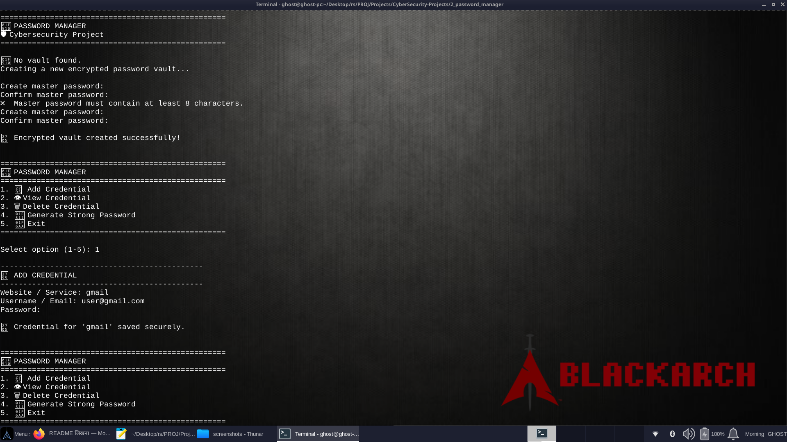
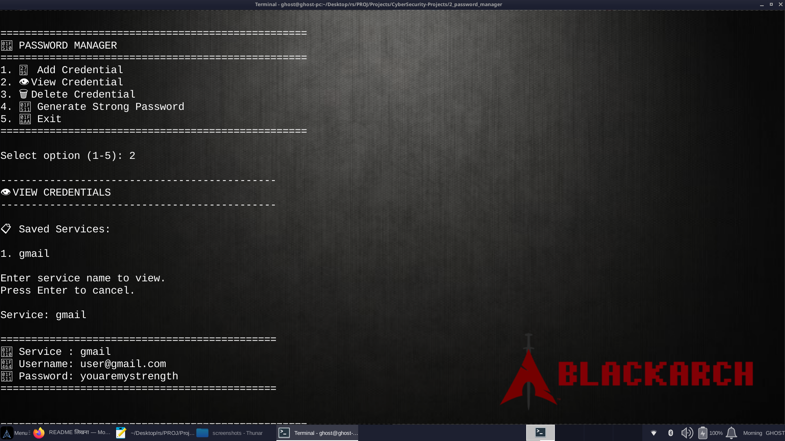
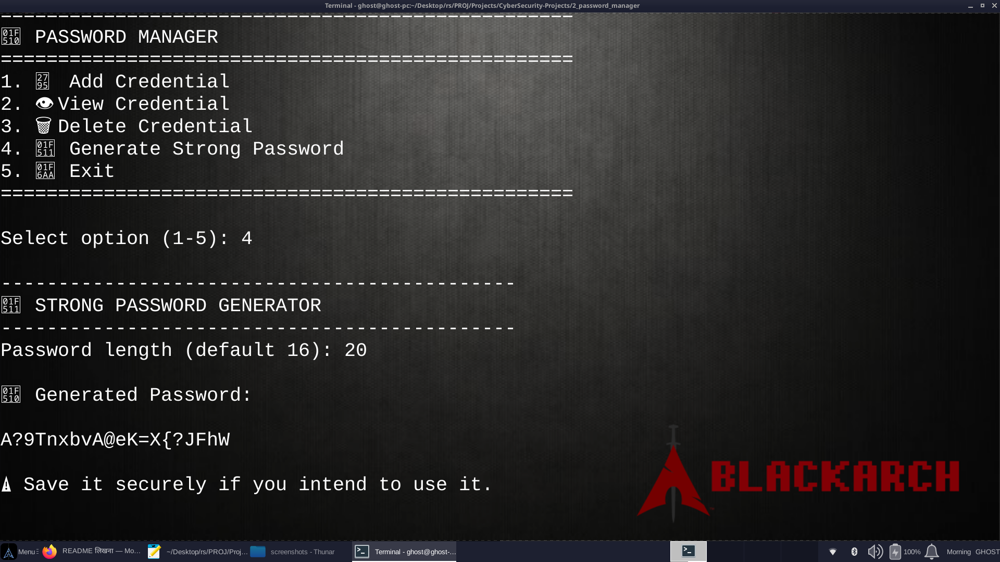

# 🔐 Password Manager

> A Python-based cybersecurity project that securely stores, manages, and protects user credentials using encryption and master-password authentication.

---

## 📌 About The Project

Passwords are one of the most important components of modern cybersecurity. However, users often reuse passwords, store them insecurely, or write them down in unsafe locations.

The **Password Manager** is a command-line cybersecurity application developed in Python that provides a simple and secure way to store and manage credentials locally.

The application protects stored credentials using **Fernet symmetric encryption** and derives the encryption key from a user-defined master password using **PBKDF2-HMAC-SHA256**.

The project provides basic password-management functionality including:

- 🔐 Master password protection
- 🔒 Encrypted credential storage
- ➕ Add credentials
- 👁️ View credentials
- 🗑️ Delete credentials
- 🔑 Strong password generation
- 💾 Local encrypted vault
- 🖥️ Command-line interface

---

## 🎯 Problem Statement

Users often store passwords in insecure locations such as:

```text
Notepad files
Text documents
Browser notes
Paper
Unencrypted files
```
This creates a security risk because anyone who gains access to those files may be able to read the stored credentials.

The purpose of this project is to demonstrate how a basic password manager can protect credentials using encryption and master-password authentication.

The system allows users to:

Create a master password.
Unlock the encrypted vault.
Store website credentials.
View stored credentials after authentication.
Delete credentials when they are no longer required.
Generate strong random passwords.

## ✨ Features

### 🔐 1. Master Password Protection

The application requires the user to create a master password when the vault is created.

Example:
Create master password: ********
Confirm master password: ********

The master password is not stored directly inside the vault.

Instead, it is used to derive an encryption key.

Security Requirements
Minimum 8 characters
Confirmation required
Empty master passwords are rejected
Incorrect master passwords cannot unlock the vault


### 🔒 2. Password-Based Key Derivation

The project uses:
	PBKDF2-HMAC-SHA256

to derive an encryption key from the master password.

A randomly generated salt is used during the key derivation process.

The project uses:
	600,000 PBKDF2 iterations

The derived key is then encoded into a format suitable for Fernet encryption.


### 🛡️ 3. Fernet Encryption

Stored credentials are encrypted using:
	Fernet Symmetric Encryption

The encrypted vault is stored locally as:
	vault.dat

The salt used for key derivation is stored separately as:
	vault.salt

The actual credential information is therefore not stored as readable plaintext inside the vault file.

### ➕ 4. Add Credentials

Users can add credentials for different websites or services.

Example:
	Website / Service: GitHub
	Username / Email: user@example.com
	Password: ********

The credential is stored in the local encrypted vault.

Stored information includes:

	Service
	Username / Email
	Password
### 👁️ 5. View Credentials

After successfully unlocking the vault, users can view saved credentials.

Example:
	📋 Saved Services:

		1. GitHub
		2. Gmail
		3. LinkedIn

	Service: GitHub

```
=============================================
🌐 Service : GitHub
👤 Username: user@example.com
🔑 Password: ********
=============================================
```
Credentials are decrypted only when the vault is successfully unlocked.

### 🗑️ 6. Delete Credentials

Users can delete stored credentials.

Example:

	DELETE CREDENTIAL

	Saved Services:

		• GitHub
		• Gmail
		• LinkedIn

	Enter service to delete: GitHub

	Delete 'GitHub'? (y/N): y✅ Credential deleted successfully.

The vault is encrypted again after modification.

### 🔑 7. Strong Password Generator

The application includes a password generator.

It creates random passwords using:

Lowercase letters
Uppercase letters
Numbers
Special characters

Example:

	🔐 Generated Password:
		vR7!qL2@xP9#kT4$

The generator guarantees that the generated password contains at least one character from each major character category.

The project uses Python's secrets module for password generation.

### 💾 8. Local Encrypted Vault

The project stores the password vault locally.

Main files:

	vault.dat
	vault.salt

The vault does not need a cloud database or remote server.

This makes the project suitable for local cybersecurity demonstrations and educational purposes.


## 🔄 How The System Works

The overall workflow is:
```
                    ┌─────────────────────┐
                    │    Start Program    │
                    └──────────┬──────────┘
                               ↓
                    ┌─────────────────────┐
                    │  Vault Exists?      │
                    └───────┬─────┬───────┘
                            │     │
                           No    Yes
                            │     │
                            ↓     ↓
                 ┌────────────┐  ┌──────────────┐
                 │Create Vault│  │Enter Master  │
                 │            │  │Password      │
                 └──────┬─────┘  └──────┬───────┘
                        │                │
                        ↓                ↓
                 ┌─────────────────────────────┐
                 │ PBKDF2-HMAC-SHA256          │
                 │ Key Derivation              │
                 └─────────────┬───────────────┘
                               ↓
                    ┌─────────────────────┐
                    │ Fernet Encryption   │
                    └──────────┬──────────┘
                               ↓
                    ┌─────────────────────┐
                    │    Unlock Vault     │
                    └──────────┬──────────┘
                               ↓
                 ┌──────────────────────────┐
                 │       Main Menu         │
                 └────────────┬─────────────┘
                              ↓
          ┌──────────┬────────┼────────┬──────────┐
          ↓          ↓        ↓        ↓          ↓
        Add        View     Delete   Generate    Exit
      Credential Credential Credential Password
          │          │        │        │
          └──────────┴────────┴────────┘
                              ↓
                    ┌─────────────────────┐
                    │ Encrypted Vault     │
                    │ Updated & Saved     │
                    └─────────────────────┘
```                    
## 🧠 Security Architecture

The project uses multiple security concepts.

```
		  Master Password
		       │
		       ↓
		   Random Salt
		       │
		       ↓
       PBKDF2-HMAC-SHA256
		       │
		       ↓
     Derived Encryption Key
		       │
		       ↓
		    Fernet
 		       │
		       ↓
        Encrypted Vault
```
## Components

    -|-----------------------|----------------------------------------------------------|-
     |	Component	     	 |	Purpose													|
    -|-----------------------|----------------------------------------------------------|-
     |	Master Password	     |	Authentication and key derivation input					|
     |	Random Salt	     	 |	Makes key derivation resistant to precomputed attacks	|
     |	PBKDF2-HMAC-SHA256   |	Derives encryption key from master password				|
     |	Fernet		     	 |	Encrypts and decrypts vault data						|
     |	JSON		     	 |	Structures credential data before encryption			|
     |	secrets		     	 |	Generates secure random passwords						|
     |	getpass		     	 |	Prevents password input from being displayed			|
    -|-----------------------|----------------------------------------------------------|-


## 🛠️ Technologies Used

### Programming Language
Python 3.6+

### Python Modules
#### Standard Library
base64
json
os
secrets
string
pathlib
getpass

#### External Library
cryptography

The cryptography package provides the Fernet encryption implementation and cryptographic key-derivation functionality used by the project.

## 📦 Requirements

Python:
Python 3.6+

Python package:
cryptography

Install the dependency using:
```
pip install -r requirements.txt
```

## 🚀 Installation

### Step 1 — Clone Repository
```
git clone https://github.com/YOUR-USERNAME/password_manager.git
```
### Step 2 — Enter Project Directory
```
cd password_manager
```
### Step 3 — Install Dependencies
```
pip install -r requirements.txt
```
### Step 4 — Run Application
```
python password_manager.py
```

## ▶️ Usage

After starting the program, the application displays:

```
==================================================
🔐 PASSWORD MANAGER
🛡️ Cybersecurity Project
==================================================
```
If no vault exists, the application asks the user to create a master password.

If a vault already exists, the application asks for the master password.

After successful authentication, the main menu is displayed:

```
==================================================
🔐 PASSWORD MANAGER
==================================================
1. ➕ Add Credential
2. 👁️ View Credential
3. 🗑️ Delete Credential
4. 🔑 Generate Strong Password
5. 🚪 Exit
==================================================
```

## ➕ Adding A Credential

Select:
```
1
```
Example:

```
➕ ADD CREDENTIAL

Website / Service: GitHub
Username / Email: yash@example.com
Password: ********

✅ Credential for 'GitHub' saved securely.
```
The information is encrypted before being written to the vault.


## 👁️ Viewing A Credential

Select:
```
2
```
The application displays the saved services.

Example:
```
📋 Saved Services:

1. GitHub
2. Gmail
3. LinkedIn
```
After selecting a service:
```
=============================================
🌐 Service : GitHub
👤 Username: yash@example.com
🔑 Password: MySecurePassword!
=============================================
```

## 🗑️ Deleting A Credential

Select:
```
3
```
Then enter the service name.

The application asks for confirmation before deleting the credential.

```
Delete 'GitHub'? (y/N): y

✅ Credential deleted successfully.
```

## 🔑 Generating A Password

Select:
```
4
```
Enter the desired length:
```
Password length (default 16): 16
```
Example result:
```
🔐 Generated Password:

vR7!qL2@xP9#kT4$
```

## 📁 Project Structure

password_manager/
│
├── password_manager.py       # Main Python application
├── requirements.txt          # Python dependencies
├── README.md                 # Project documentation
├── .gitignore                # Files excluded from Git
│
└── screenshots/              # Project screenshots
    ├── output1.png
    ├── output2.png
    └── output3.png

After running the application, the following local files may also be created:
```
vault.dat
vault.salt
```
These files contain the encrypted vault and key-derivation salt.

Do not upload them to GitHub.

## 📸 Screenshots

Project screenshots are stored inside:
```
screenshots/
```
Recommended screenshots:
### 1. Main Menu
```
screenshots/output1.png
```
### 2. Adding / Viewing Credentials
```
screenshots/output2.png
```
### 3. Password Generator
```
screenshots/output3.png
```
You can display them in this README using:

```





```

##🧪 Testing

The project can be tested using the following scenarios.

|-------------------------------|---------------------------------------|-
|Test Case						|	Expected Result			  			|
|-------------------------------|---------------------------------------|-
|Create master password			|	Vault created successfully	  		|
|Incorrect master password		|	Access denied			  			|
|Correct master password		|	Vault unlocked			 		 	|
|Add credential					|	Credential saved		  			|
|View credential				|	Credential displayed		  		|
|Delete credential				|	Credential removed		  			|
|Generate password				|	Strong random password generated  	|
|Empty username					|	Input rejected			  			|
|Empty password					|	Input rejected			  			|
|Invalid generator length		|	Error handled			  			|
|Exit application				|	Vault locked			  			|
|-------------------------------|---------------------------------------|-


## 🔐 Security Considerations

This project demonstrates several important cybersecurity concepts.

### Password Input Protection
The project uses:
```
getpass()
```
so passwords are not displayed directly while being entered.

### Random Salt
A random 16-byte salt is generated for the vault.

### Key Derivation
PBKDF2-HMAC-SHA256 is used to derive the encryption key.

### Encryption
Fernet is used for symmetric encryption of the vault.

### Secure Random Generation
The password generator uses Python's:
```
secrets
```
module instead of the ordinary random module.

### Local Storage
The encrypted vault is stored locally rather than being transmitted to an external server.


## ⚠️ Limitations

This is an educational/basic password-manager implementation and has some limitations:

	1. It is a command-line application.
	2.The vault is stored on the local machine.
	3.There is no cloud synchronization.
	4.There is no multi-device synchronization.
	5.There is no graphical user interface.
	6.There is no browser extension.
	7.There is no automatic password autofill.
	8.There is no built-in password-breach monitoring service.
	9.The master password cannot be recovered if forgotten.
	10.Clipboard integration is not implemented.
	11.The project has not been designed as a production-grade commercial password manager.


## 🔮 Future Improvements

The project can be extended with:

### 🌐 Web Interface
Create a secure web-based interface for managing credentials.

### 🖥️ GUI Application
Develop a desktop interface using:
```
Tkinter
PyQt
CustomTkinter
```

### 📱 Mobile Application
Develop Android and iOS versions.

### 🌍 Browser Extension
Provide secure browser-based autofill functionality.

### ☁️ Secure Cloud Synchronization
Implement encrypted synchronization between trusted devices.

### 🚨 Breach Monitoring
Add privacy-preserving checks against compromised password databases.

### 🔑 Password Strength Analyzer
Integrate password-strength analysis before saving a password.

### 📋 Clipboard Protection
Provide secure temporary clipboard copying with automatic clearing.

### 👥 Multiple Vaults
Allow users to create and manage multiple encrypted vaults.

### 📊 Security Dashboard
Provide information such as:
```
Weak Passwords
Reused Passwords
Old Passwords
Password Strength
Security Recommendations
```

## 🎓 Educational Purpose

This project was developed as a cybersecurity learning project.

It demonstrates practical concepts including:

	Password security
	Symmetric encryption
	Key derivation
	Random salt generation
	Secure random password generation
	Local encrypted storage
	Authentication
	Secure password input
	Credential management
	Basic secure coding practices

The project is intended for educational and controlled demonstration purposes.


## 🔒 Privacy

The application is designed for local credential storage.

Passwords should never be uploaded to public repositories.

Before publishing the project to GitHub, make sure the following files are excluded:
```
vault.dat
vault.salt
vault.tmp
```
The .gitignore file included in this project helps prevent accidental uploads.


## 🚫 Important GitHub Security Rule

Never commit your actual password vault to GitHub.

Do NOT upload:
```
vault.dat
vault.salt
```
Even though the vault is encrypted, private credential-storage files should not be placed in a public repository.


## 🤝 Contributing

Contributions and suggestions are welcome.

### Clone the project
```
git clone https://github.com/YOUR-USERNAME/password_manager.git
```
### Create a branch
```
git checkout -b feature/new-feature
```
### Make changes
```
git add .
```
### Commit changes
```
git commit -m "Add new feature"
```
### Push branch
```
git push origin feature/new-feature
```

Then create a Pull Request on GitHub.


## 📜 License

This project is intended primarily for educational and cybersecurity learning purposes.

If an open-source license is added to the repository, this section should be updated accordingly.


## 👨‍💻 Author

### Yash Raj

```
Project     : Password Manager
Domain      : Cybersecurity
Language    : Python
Interface   : Command Line
Project Type: Educational Cybersecurity Project
Year        : 2026
```

## 📌 Project Status
```
Project Status : ✅ Completed
Language       : Python
Interface      : CLI
Encryption     : Fernet
Key Derivation : PBKDF2-HMAC-SHA256
Storage        : Local Encrypted Vault
Password Gen.  : secrets module
```

## ⭐ Acknowledgement

This project was developed as part of a cybersecurity project assignment to demonstrate practical implementation of secure credential storage, encryption, authentication, and password generation.

## 🔐 Stay Secure. Protect Your Credentials. 🛡️

If you found this project useful, consider giving the repository a ⭐ Star.
